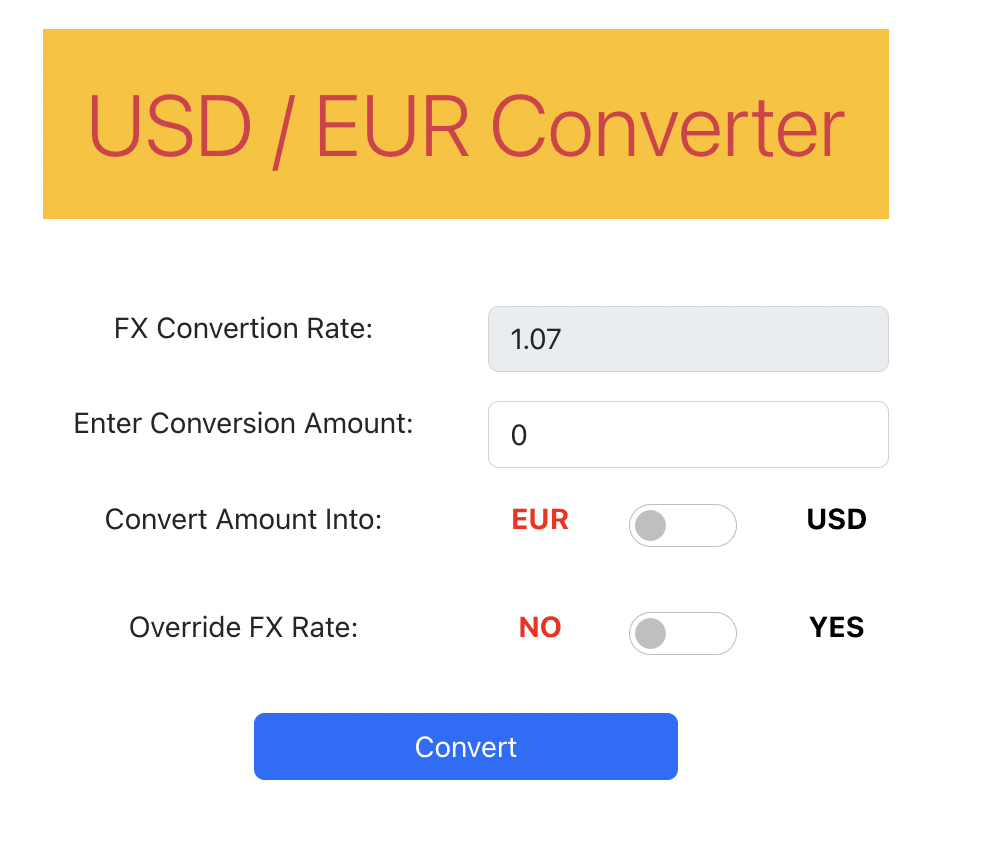
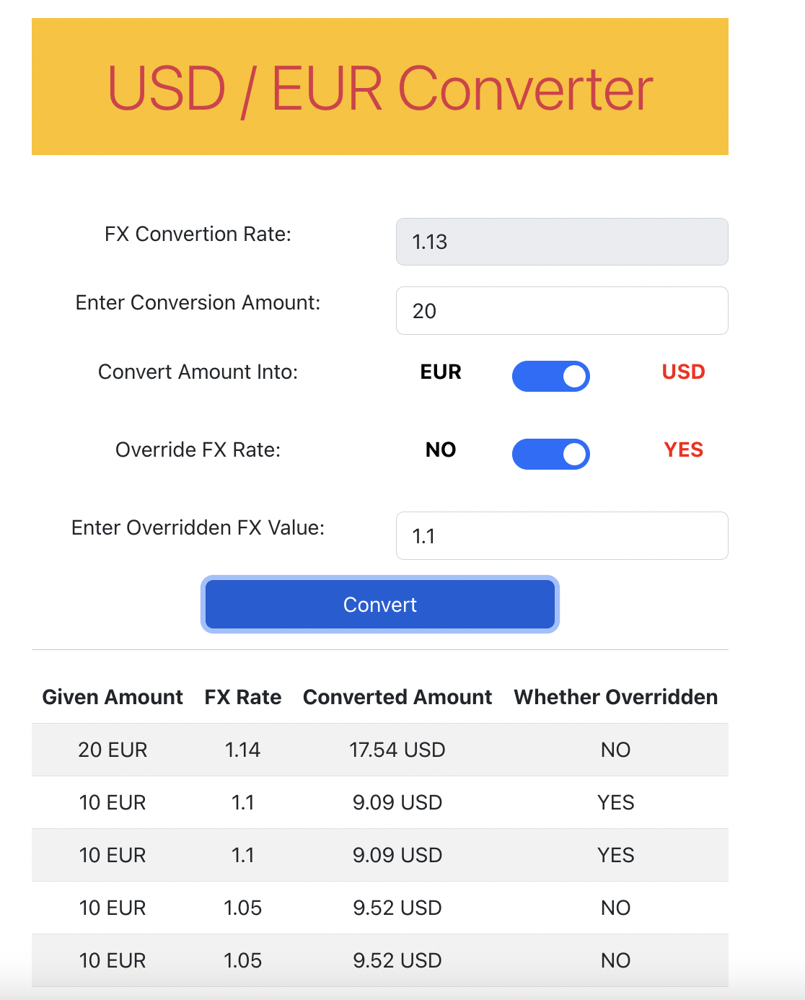

# Welcome to Currency Converter App ( USD / EUR ) in React:
The currency converter is a simple application that converts USD / EUR currency into EUR / USD respectively. Here, FX conversion rate is used and is generated dynamically every 3 seconds.

## Steps to setup and configure the currency converter application:

Open terminal and run following command:

### `npm install`
After all the dependencies are installed, run following command:

### `npm start`

Currency Converter App - USD / EUR , a React app will now run in the development mode.

Open [http://localhost:3000](http://localhost:3000) to view your currency converter in your browser.

## Tech Stack Used:

**Client:** React, Bootstrap

## Screenshots

